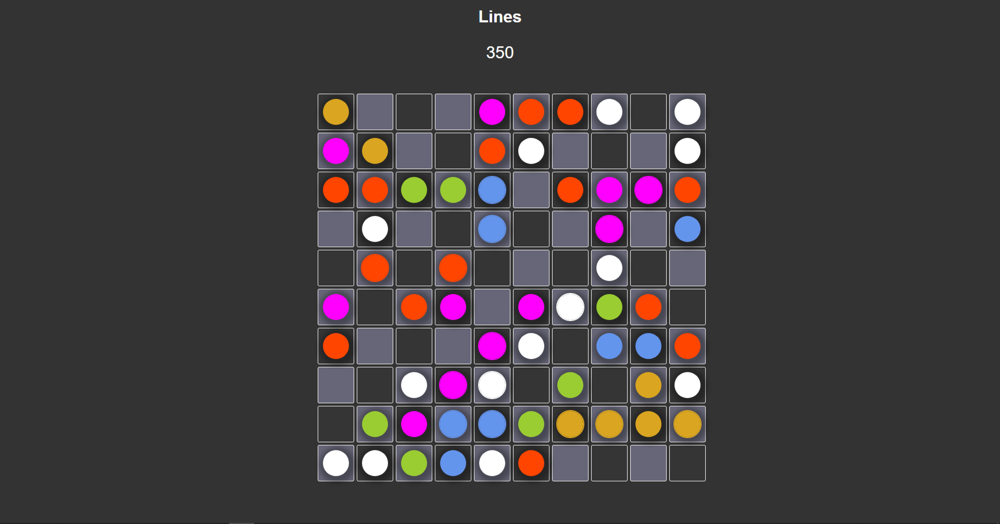

# Lines

 
 
Hello, this is my implementation of the Lines game.
Rules are simple, build 5 or more consecutive balls of the same color in a row, column or diagonal, then those balls will be cleared of the board and you will
earn points. Ball can be moved horizontaly and verticaly, and not diagonaly. The game is played until open fields exists. 3 new balls are placed after every move, except when you score. Points are multiplied by 10 for every ball you clear of the board.
 
 
It is a bit simplified version, because there are no restrictions in players ball placement. Player can put the ball in any open field, regardless if that spot
is 'surrounded' with other balls. This is because I had a problem to implement the 'shortest path algorithm', so I decided to finish with simpler version.
 
Click <a href="https://ivanmpr.github.io/Lines-FULL/"> HERE</a> for the final version of this game.
 
HTML, CSS, JS
 
